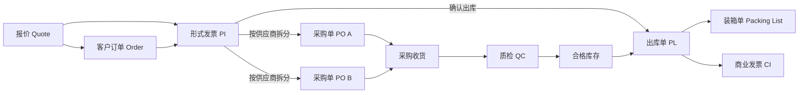

# 货仓与贸易管理系统：正确业务逻辑说明

## 一、业务目标

本系统要解决的不是“把若干表单放到网页里”，而是让销售订单、报价、PI、出库、采购、装箱和商业发票形成一条可追溯的数据链。任何下游单据都必须能找到唯一的上游来源，任何数量变化都必须满足库存与订单约束，任何业务节点都必须由真实动作触发，不能因为打开页面或修改无关状态而自动完成。

系统中的核心链路是：



其中，客户订单号是销售侧扣数和追踪的主键；PI 是客户成交内容；PL 是一次真实出库确认；PO 是向供应商采购的内容；装箱单和商业发票都以 PL 的实际出库数据为准。

## 二、主数据与交易数据必须分开

样品、产品、客户、供应商和品牌属于主数据。报价、订单、PI、PL、PO、装箱单和商业发票属于交易数据。

交易单据只能引用主数据或保存必要的快照，不能反向、无条件地覆盖主数据。例如，保存 PI 明细时不得把产品库存改成 0，不得把客户成交价写回产品基础价格，也不得把 PI 中临时输入的名称直接覆盖样品名称。库存只能由入库、调整、锁定和出库等库存流水改变。

正确做法是：

- 产品主数据保存稳定属性，例如产品代码、名称、默认供应商和图片。
- 报价、PI、PO 保存当时使用的名称、规格和价格快照，保证历史单据不会因主数据后续修改而变化。
- 库存保存流水，产品表中的库存数只能作为流水汇总结果或缓存。

## 三、报价逻辑

一张报价可以有多条产品明细、多个供应商成本方案和多个客户报价档位。

### 1. 数量字段的含义

- `quantity` 是客户预计或确认的订单数量。
- `sampleQty` 是供应商提供或制作的样品数量。
- 两者不能互相替代。生成 PI 时只能使用订单数量，绝不能把样品数当成订单数。

### 2. 阶梯价匹配

阶梯价按照“已达到的最高档位”匹配。例如价格档位为 1,000、3,000、5,000 件：

- 800 件使用最低档或提示低于 MOQ；
- 3,000 件使用 3,000 件档；
- 4,000 件仍使用 3,000 件档；
- 5,000 件使用 5,000 件档。

不能用“第一个大于等于订单量的档位”，否则 4,000 件会错误使用 5,000 件价格。

### 3. 价格分层

- 供应商采购价是成本价，进入 PO。
- 客户报价档位是销售价，进入 PI 和商业发票。
- 两者必须使用不同字段，不能用同一个 `price` 在不同单据中反复解释。

生成 PI 时，只生成被勾选且数据有效的报价明细；没有勾选有效明细时必须阻止生成。

## 四、客户订单逻辑

客户订单至少需要保存：系统订单号、客户订单号、客户、产品、数量、客户单价、币种、渠道和状态。

订单金额只能由系统计算：

```text
订单金额 = 订单数量 × 客户单价
```

前端展示、后端接口和数据库都应重新计算金额，不能信任客户端传入的总金额。生成 PI 时，数量和单价必须原样继承，不能把整单金额当成单价，也不能把数量固定为 1。

## 五、PI、扣数与出库逻辑

PI 每条明细都应保存以下数量：

- 订单数量 `orderQty`
- 已扣数量 `deductedQty`
- 未交数量 `outstandingQty`
- 当前可用库存 `inStockQty`
- 本次出库数量 `stockOutQty`

必须始终满足：

```text
未交数量 = 订单数量 - 已扣数量
0 ≤ 已扣数量 ≤ 订单数量
0 ≤ 本次出库数量 ≤ 未交数量
0 ≤ 本次出库数量 ≤ 当前可用库存
PI 表头数量 = 所有 PI 明细数量之和
```

PI 的状态与出库动作是两件事。草稿 PI 不能确认出库；仅修改 PI 状态也不能凭空扣减库存。用户必须在明细层填写并确认本次出库数量，系统校验通过后才执行出库。

### PL 的生成规则

PL 不是创建 PI 时预先占用的编号。只有在本次出库数量大于 0、PI 已脱离草稿状态并成功保存后，系统才生成 PL。

- 一个 PL 对应一次已确认的出库快照。
- PL 编号必须唯一。
- PL 生成后，装箱单与商业发票都以该快照为准。
- 取消或冲销出库应生成反向库存流水，不能直接删除历史记录。

当前简化版本把一次 PI 出库对应为一个 PL；若以后支持同一 PI 多批出库，应把 PL 独立为一对多实体，而不是继续在 PI 表中只放一个 `plNo`。

## 六、采购单逻辑

一个 PI 可以对应多张 PO，因为同一客户订单中的产品可能来自多个供应商。

生成 PO 时应执行以下规则：

1. PI 必须已经确认出库并生成 PL。
2. 每条 PI 明细必须指定供应商和采购单价。
3. 系统按供应商分组，每个供应商生成一张 PO。
4. 同一 PI、同一供应商不能重复生成 PO。
5. 每张 PO 使用独立且唯一的 PO 编号。
6. PO 继承采购数量和采购单价，不得使用客户销售价。
7. 所有 PO 成功写入后，才记录“采购生成时间”；任何失败都不能提示全部成功。

PO 的状态只能表达采购单自身的生命周期，例如草稿、确认、发送和关闭。不能因为 PO 从草稿改成已发送，就自动写入财务审批、装箱完成或收款完成时间。这些节点必须由各自的真实业务动作触发。

## 七、装箱单与商业发票

### 1. 装箱单

一个 PL 只能有一份当前有效装箱单。装箱单可以包含多个箱、LOT 或尺码行，但所有行的数量之和必须等于 PL 的实际出库数量：

```text
装箱明细总数量 = PL 出库数量
```

数量统一使用件数 `PCS`。如果业务需要使用 M、K、箱或包等单位，应保存明确的单位和换算率，不能在界面中无依据地乘以 1,000。

### 2. 商业发票

商业发票必须从 PL 和对应 PI 的客户成交价生成，不能从 PO 生成，因为 PO 保存的是供应商采购价。

商业发票默认继承 PI 的客户价格，但允许在生成发票时保存独立的价格快照。支持两种计价方式：

- 明细计价：每行数量 × 发票单价；
- `LOT PRICE`：整批使用一个总价，明细行不再重复计算金额。

商业发票编号、来源 PL、币种、价格模式和最终价格必须持久化。打开预览页面不等于生成发票，也不能仅因查看页面就写入“商业发票生成时间”。

## 八、采购收货、质检与批次库存

后续收货流程应以 PO 为来源：

1. 供应商发货后登记到货批次和 YZ/供应商批号。
2. 收货数量不能超过 PO 未收数量，超收需要单独授权。
3. 到货先进入待检库存，不直接进入可用库存。
4. QC 记录合格、不合格、返工和报废数量，合计必须等于送检数量。
5. 只有合格数量进入可用库存。
6. 客户出库从具体库存批次扣减，以支持追溯和分批发货。

库存应使用流水表达：采购入库为正数，客户出库为负数，退货、报废和盘点调整分别使用独立业务类型。任何库存变化都应保存操作人、时间、来源单据和批次。

## 九、编号、状态和时间线

PI、PL 和 PO 编号都必须在数据库层保证唯一，不能只依赖前端扫描当前列表后自增。前端生成编号用于改善体验，数据库约束负责最终防重。

时间线记录的是事件，不是推测。正确触发关系如下：

| 时间节点 | 唯一触发动作 |
| --- | --- |
| PI 开立 | PI 首次成功保存 |
| PL / 出库 | 库存校验通过并确认出库 |
| 采购生成 | 对应 PO 成功写入 |
| 财务审批 | 财务人员明确审批 |
| 装箱完成 | 装箱单校验并确认 |
| 商业发票生成 | 发票价格快照成功保存 |
| 收款确认 | 财务人员登记真实收款 |

页面浏览、打印预览和普通编辑都不能触发这些业务时间。

## 十、失败处理与审计

保存失败时，系统必须明确提示“未写入服务器”，不能显示“已保存到本地”来制造已持久化的错觉。涉及多张 PO、库存和单据状态的操作应使用事务或幂等批处理接口，避免只成功一部分。

关键交易数据不应物理删除。正确做法是作废、冲销或保留版本，并记录操作人、操作时间、变更前后内容和原因。这样才能回答三个最重要的问题：这笔数量从哪里来、被谁改过、最终流向哪里。

## 十一、当前交付边界

本次版本已落实报价数量与阶梯价、订单数量与单价、PI 明细数量约束、确认出库后生成 PL、PI 不覆盖产品主数据、按供应商拆分 PO、采购价与客户价分离、CI/装箱从 PL 展示、编号防重和失败提示等 P0 规则。

采购收货、YZ/QC、库存批次、同一 PI 多批 PL，以及商业发票价格快照的独立持久化，属于下一阶段需要建立独立实体和库存事务的功能，不能用现有 PI/PO 状态字段替代。
